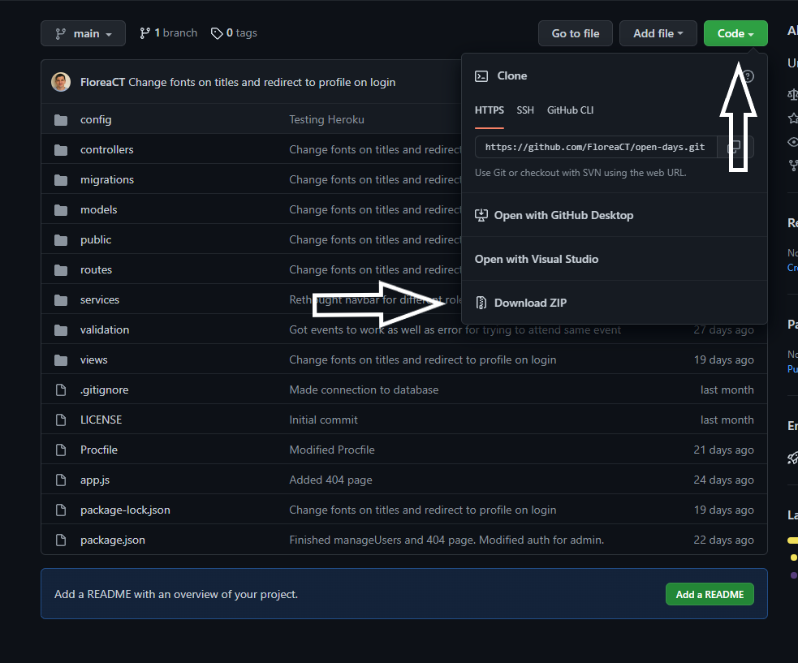
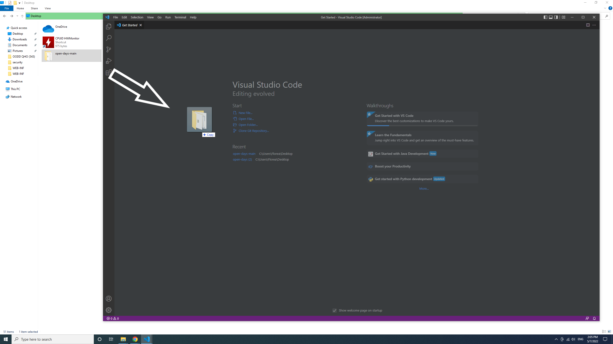
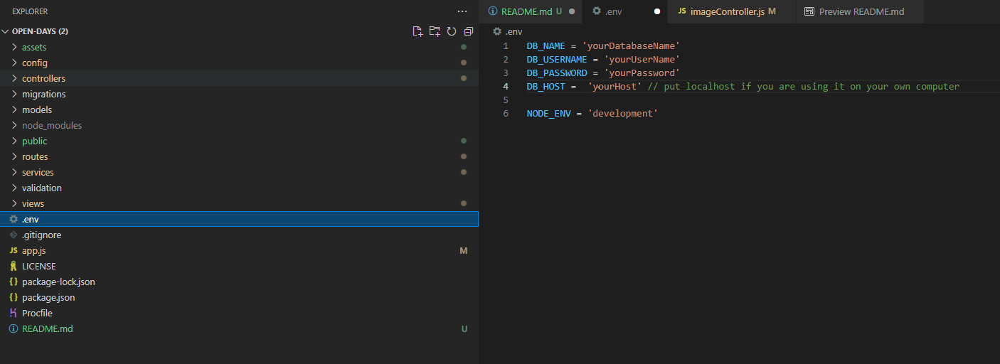
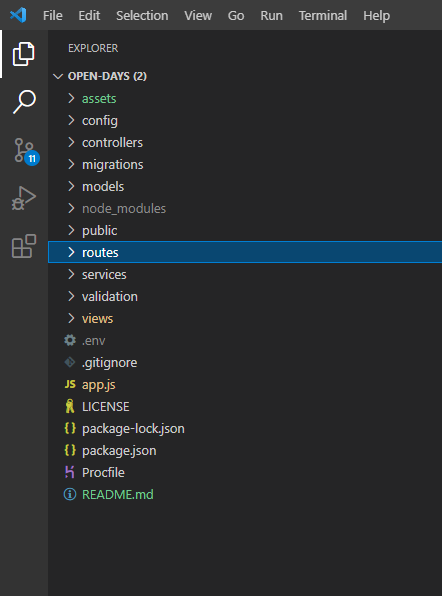
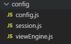
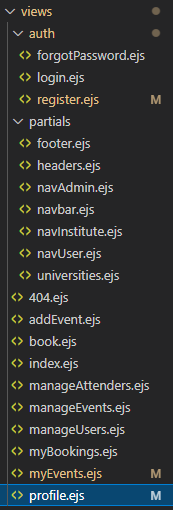

# open-days

University project for Advanced Databases in order to demonstrate and apply full stack technologies. 

## 1. About 

The project main idea is to create a space where institutions (universities) to add their open days and students can see all of the events and be able to subscribe to them. 

Before you get started you will need to have installed the following: 
- An IDE (I've used VS Code)
- NODE JS
- GIT (In case you want to use the second method of accessing the repository)

Tools used for creating the app:

- Node JS
- Express
- EJS
- HTML/CSS
- JAVA + JS
- MySQL (for database)
- Heroku (for deployment)

The website is comprise of 3 category of users:

- Institution: The institution can add their Open Day details (Starting hour, ending hour, details, picture) and can view/delete it.
- User: Can book to any Open Day (once) and can view a list of place where he had booked
- Admin: Can view/edit/delete users, bookings, and events. For now admins can book/create events.

<div style="page-break-after: always;"></div>

## 2. How to get started

- You will need to clone the repository anywhere in your computer. You have two ways of doing this: 
    ### 1. First method:
    
    Download and extract the repository and save it wherever you want on your computer.

  ### 

  <div style="page-break-after: always;"></div>
  
    Then you need to open VS code and add drag and drop the folder you've just extracted to it

  ### 

    In the VS terminal you will need to write in the exact order:
    - <code>git -init</code>
    - <code>npm install</code>
    - <code>npm start</code>

    The server should be now up and running on port 3030. You should be able to access the website using the following link [localhost:3030](http://localhost:3030/)

    ### 2. Second method:

    Create a folder anywhere on your computer. Open a cmd and navigate to that folder. 
    
    After that use the following command in order to clone the repository:

    - <code>git clone https://github.com/FloreaCT/open-days.git</code>

    <div style="page-break-after: always;"></div>

    You should have a new folder created like the one showed bellow

    

    Open VS Code and add the folder inside like in this example [How to add a folder](#how-to-add-folder)

    In the terminal use the following commands in order to get started:

    - <code>npm install</code>
    - <code>npm start</code>

    After that you need to add your Database details here

    ### 

    <div style="page-break-after: always;"></div>1

    If all settings are correct, the following command should work without any errors. If you do encounter errors please double check your database details and make sure they are correct.

    - <code>npx sequelize-cli db:migrate</code>

    This will automatically create the tables in our database using the [migrations](#migrations) files

    You are done!

## 3. How it works

 

<div style="page-break-after: always;"></div>

1.<em> <b>assets</b></em> is where the pictures for this md are kept

2.<em> <b>[config](#config)</b></em> is where we have our database connection settings, session settings and the app view engine

3.<em> <b>[controllers](#controllers)</b></em> here we store our passport settings, user access, database queries and image upload settings

4.<em> <b>[migrations](#migrations)</b></em> inside we have schema files used to automate the creation of our database tables

5.<em> <b>[controllers](#controllers)</b></em> inside we have schema files used to insert data into our database

6.<em> <b>[public](#public)</b></em> it is used for storing css/js/image files

7.<em> <b>[routes](#routes)</b></em> here we define our all website routes (pages)

8.<em> <b>[services](#services)</b></em> defines some settings related to our interaction with the database

9.<em> <b>[validation](#validation)</b></em> settings for user authentication 

10.<em> <b>[views](#views)</b></em> all webpages are stored here

11.<em> <b>[env](#env)</b></em> storing variables for database connections (used for Heroku)

12.<em> <b>[.gitignore](#gitignore)</b></em> tells git which files to ignore from adding/committing

13.<em> <b>[app.js](#appjs)</b></em> main application file

14.<em> <b>[LICENSE](#license)</b></em> License for using this app

15.<em> <b>[package.json](#packagejson)</b></em> here are stored all the dependencies needed in order for this app to work

16.<em> <b>[Procfile](#procfile)</b></em> storing run commands (used for Heroku)

<p>&nbsp;</p>  <p>&nbsp;</p>

### Config

We have the following files inside config:



<div style="page-break-after: always;"></div>

<em> config.js </em>

We require dotenv in order to access the variables stored in .env file which are then used to access the database

```js
require('dotenv').config()
module.exports = {
    "development": {
        "username": process.env.DB_USERNAME,
        "password": process.env.DB_PASSWORD,
        "database": process.env.DB_NAME,
        "host": process.env.DB_HOST,
        "dialect": "mysql" // Database dialect. We can use NoSQL, SQLite, etc.
```

<em>session.js</em>

```js
const configSession = (app) => {
    app.use(
        session({
            key: "express.sid", // We can change this to whatever we would like the key to be named
            secret: "secret",
            storage: sessionStore,
            resave: true,
            saveUninitialized: false,
            cookie: {
                httpOnly: false,
                secure: false,
                maxAge: (24 * 60 * 60 * 1000) // Age of the cookie will be 1 day 
            }

        })
    );
}
```

<em>viewEngine.js</em>

**Note:** Since the app was build on ejs, this should not be modified!

```js
module.exports = {
    configViewEngine(app) {
        app.use(express.static('./public')); // By convention here we store css/js/images. You can name it any other name
        app.set('view engine', 'ejs') // View engine
        app.set('views', './views') // By default webpages are kept in views folder. IT can be any other name as well
    }
}
```

### Controllers

<em>passportLocal.js</em> 

 Used for authentication as well as serializing and deserializing the user. Meaning we will transform the user with all it's info into a Object that we can use throughout the session.

 ```js
 let initPassportLocal = () => {
    // Check if email or password exists
    passport.use(new LocalStrategy({
            usernameField: "email",
            passwordField: "password",
            passReqToCallback: true
        }, async(req, email, password, done) => {
            try {
                await loginService.findUserByEmail(email) // Waiting for response from findUserByEmail function
                    .then(async(user) => {
                        if (!user) return done(null, false, req.flash("errors", "User not found!")) // Can be modified with custom text
                        let message = await loginService.comparePassword(password, user)
                        if (message === true) {
                            return done(null, user, null)
                        } else {
                            return done(null, false, req.flash("errors", message))
                        }
                    }).catch(err => {

                        return done(null, false, req.flash("errors", err))
                    })
            } catch (error) {
                return done(null, false, error)
            }
        }

    ))
}
```

<em>authController.js</em>

Used for controlling authentication/posting.

```js
// Used to render the login page
let getPageLogin = (req, res) => {
    return res.render("login.ejs", {
        errors: req.flash("errors")
    });
};

//  Used for login.
let handleLogin = async(req, res) => {
    let errorsArr = []; // We store all the errors here and send them to the user in case there are any
    let validationErrors = validationResult(req);
    if (!validationErrors.isEmpty()) {
        let errors = Object.values(validationErrors.mapped());
        errors.forEach((item) => {
            errorsArr.push(item.msg);
        });
        req.flash("errors", errorsArr); // Sending the errors to flash to be rendered on page
        return res.redirect("/login"); // If validation fails we will send user back to login page 
    }

    try {
        await loginService.handleLogin(req.body.email, req.body.password); // If validation is successful, send user to home page
        return res.redirect("/");
    } catch (err) {
        req.flash("errors", err);
        return res.redirect("/login");
    }
};

// Checking if the user is logged in order to allow access 
let checkLoggedIn = (req, res, next) => {
    if (!req.isAuthenticated()) {
        return res.redirect('/login')
    }
    next()
}

// Checking if the user is logged out in order to deny access
let checkLoggedOut = (req, res, next) => {
    if (req.isAuthenticated()) {
        return res.redirect("/")
    }
    next()
}

// Used after user is logging out in order to delete the cookie in his browser and redirect the user to home page
let postLogOut = (req, res) => {
    req.session.destroy(function(error) {
        return res.redirect('/')
    })
}

// Checking if the user is Administrator (Value 3 stands for Administrators)
let checkRole = (req, res, next) => {
    if (req.user.roleId == 3) {
        return 3
    } else {
        // TODO: RENDER
        next()
            // res.redirect("/")
    }
}

// Checking if the user is a Organizer (Value 2 stands for Organizer)
let checkInstitute = (req, res, next) => {
    if (!req.user.roleId == 2) {
        return res.redirect('/profile')
    }
    next()
}

// Checking if is a normal user (Value 1 stands for normal user)
let checkUser = (req, res, next) => {
    if (!req.user.roleId == 1) {
        return res.redirect('/profile')
    }
    next()
}
```

<em>dataController.js</em>

Used for all the database connections

```js

const deleteFile = async function (req, res) {
  const fileToDelete = await db.myDatabase.query(
    `SELECT image FROM events WHERE userId = ${req.user.id}` // We use this query to get the image file location in order to be able to delete it from the server
  ); 
  if (fileToDelete[0][0].image == "/images/banner_uni.jpg") { 
    // Since our default value is '/images/banner_uni.jpg' we don't want this to be deleted in case the user did not upload any image. We left if empty since we don't want anything to happen
  } else {
    fs.unlink(
      `${
        __dirname.replace("controllers", "public") + fileToDelete[0][0].image // Sincer __dirname will retrieve our current path, we want to change controllers to public in order to delete the image
      }`,
      function (err) {
        if (err) throw err;
        // if no error, file has been deleted successfully
        console.log("File deleted!");
      }
    );
  }
};

post_event // Used by Organization to post an event
events // Checks if the user is an Admin or normal user before granting access to page. Organizers should not have access here. Finds all the bookings in the database.
oneEvent // Retrieves from the database the posted event for the logged organizer.
getMyBookings // Retrieves all bookings from the current user
submitInterest // Register user to selected event. 
deleteEvent // Deletes organizer event
removeBooking // Remove booked event from user
getAllEvents // Displays all events in the database
getAllUsers // Retrieve all users from the database
getAllAttenders // Retrieves all bookings from the database
findUser // Finds a particular user
findAttender // Finds a particular booking
editUser // Edits a user
deleteUser // Deletes a user
deleteAttender // Deletes a particular booking
```

<em>homepageControler.js</em>

Used for controlling registration/login.

```js
let getHomepage = (req, res) => {
    if (!req.user) {
        var user = false // Controls top_nav bar. Based on its value, different nav bar will be rendered. 
        var isAuth = req.isAuthenticated()
        res.render('index', { user: user, isAuth: isAuth })
    } else {
        var user = req.user
        var isAuth = req.isAuthenticated()
        return res.render('index', { user: user, isAuth: isAuth })
    }
}

let createNewUser = async(req, res) => {
    let user = req.body;
    await userService(user); // Before creating a new user, we need to check if user already exists.
    return res.redirect("/") // If registration is successful, user will be redirected to home page
} 

let forgotPassword = async(req, res) => {
    let form = {
        email: req.body.email,
        error: `Password reset email has been sent to ${req.body.email}`
    }

    try {
        let isEmail = await findUserByEmail(req.body.email) // Checking if the email is in our database
        if (isEmail) {
            return res.write(
                `<script>window.alert("Reset password email has been sent to ${req.body.email}");window.location="/";</script>` // Returning a script message on the same page
            );
        } else {
            return res.redirect("/forgotPassword") // If we can't find the email in our database, we redirect the user back to forgotPassword
        }
    } catch (err) {
        req.flash('errors', err)
        return res.render("auth/forgotPassword.ejs", {
            errors: req.flash('errors'),
            form: form
        })
    }
}

getProfilePage // Renders user profile page
getRegisterPage // Creates a form with all the required variables needed for creating a new user. Must match with the database attributes.
getLoginPage // Renders login page
handleRegister
getAdminPage // Renders Admin page
getForgotPassword // Renders Forgot password page
getEventsPage // Renders organizations event page
```

<em>imageController.js</em>

Used for controlling image uploading.

```js
// Function to save the file on the server (not on the database)
var storage = multer.diskStorage({
    destination: (req, file, callBack) => {
        callBack(null, "./public/images/uploadedImages") // './public/images/' directory name where to save the file
    },
    filename: (req, file, callBack) => {
        callBack(null, file.fieldname + '-' + Date.now() + path.extname(file.originalname))
    }
})

// Multer is a node.js middleware for handling multipart/form-data, which is primarily used for uploading files.
var upload = multer({
    storage: storage
});

// Function to save the filename in the database (not the picture itself)
const image = (req, res) => {
    if (!req.file) {
        res.redirect('/myEvents')
    } else {
        var imgName = '/images/uploadedImages/' + req.file.filename // This will be the name stored in the Database which we will retrieve later on when we need to delete the file from the server. It will act as the path.
        var insertData = `UPDATE events SET image = "${imgName}" WHERE userId = ${req.user.id}` 

        db.myDatabase.query(insertData, (err, result) => {
            if (err) throw err
        })

        res.redirect('/myEvents')
    }
}
```

### Migrations

Since we are using Sequelize, we created the migration file, which will automate the creation/deletion of tables on/from a database. Using this we can port the application on mostly any database without the need of manually recreating the tables.

### Models

Models are used by Sequelize to replace the need of raw queries in our webapp. As examples, in stead of writing SELECT * FROM myTable we could write models.myModels.findall(). More details can be found [here](https://sequelize.org/docs/v6/core-concepts/model-basics/#:~:text=Models%20are%20the%20essence%20of,(and%20their%20data%20types).).

### Public

Public folder is mostly used for files that can be access or is it used by our website visitors as well as settings for our website, for example CSS files and JS and Images.

### Routes

Routes are actually the paths to all our website links used by the webapp. It includes POST links as well.

```js
module.exports = {
    initAllWebRoute(app) {
        router.get("/", homepageController.getHomepage, authController.checkRole) // Getting home page and checking the role of our visitor
        router.get("/register", authController.checkLoggedOut, homepageController.getRegisterPage) // Checking if user is logged in, if not, get registration page
        router.get("/login", authController.checkLoggedOut, homepageController.getLoginPage) // Checking if user is logged in, if not, get login page
        router.get("/profile", authController.checkLoggedIn, homepageController.getProfilePage) // Checking if user is not logged in, if it is, get his profile page.
        .
        .
        .
        router.post("/book", dataController.submbitInterest) // Enrolling a user to an event
        router.post("/addEvent", (imageController.upload, dataController.addEvent)) // Adding a new event
        router.post("/deleteEvent", dataController.deleteEvent) // Delete an event
```

### Services

<em>addEventService.js</em>

Service used for adding an event to the database. 

```js
let addAEvent = (event, req, res) => {
    return new Promise(async(resolve, reject) => {
        try {
            // Checking if event already exists in the db
            // Return true if event exists in db
            let doesEventExists = await eventExists(event, req, res) // A function that checks the database for 1 event for the logged user.
            if (doesEventExists) { // We can remove this if block to allow Institutes to have more then 1 event.
                reject(`You can have only 1 event.`)
```

<em>loginService.js</em>

Service used for login purposes. It checks if current email exists, if password entered is correct, and also if recovery email exists.

<em>submitService.js</em>

Service used for registering a user to an event. If the user has already registered to a particular event, he wont be able to do it again. 

<em>userService.js</em>

Service used for registration purposes. Checks if email exists in the database before creating. Checks if user entered a special code to change his role.

### Validation

Checks if email is valid, if password has a certain length and if password confirmation matches.

<div style="page-break-after: always;"></div>

### Views



Here we keep all of our webpages which are formatted as ejs. Page elements have been separated from all the pages, as example; header, footer, navbar for easier maintenance and scalability.

### .env

Contains database informations, like user, password, host. It will be used by our session.js file in order to authenticate on database server.

### .gitignore

Contains a list of files that should be ignored by git. This way we will avoid uploading to github or other platform files with sensitive informations.

### app.js 

Here is our main app file. Here we tell our app what modules to load, what modules to use, how to use them, what engine to use to render our webpages, setting PORT number, etc.

### LICENSE

Here we keep our license details for other people to read in case they want to use/re-use/modify our app. 

### package.json

Here we have details about our webapp name, creator, repository links as well as all the dependencies needed in order for the webapp to properly work. 

### Procfile

Its only use is for Heroku. 2 predefined commands are stored here that can be used inside Heroku domain.

