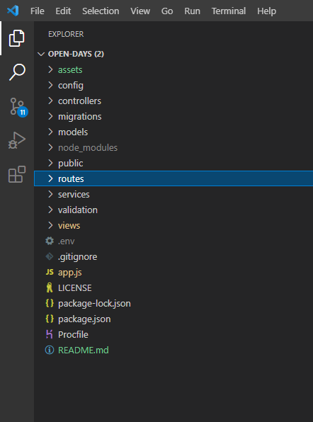

# open-days
University project for Advanced Databases in order to demonstrate and apply full stack technologies. 

## 1. About 

The project main idea is to create a space where institutions (universities) to add their open days and students can see all of the events and be able to subscribe to them. 

The website is comprise of 3 category of users:

- Institution: The institution can add their Open Day details (Starting hour, ending hour, details, picture) and can view/delete it.
- User: Can book to any Open Day (once) and can view a list of place where he had booked
- Admin: Can view/edit/delete users, bookings, and events. For now admins can book/create events.

Before you get started you will need to have installed the following: 
- An IDE (I've used VS Code)
- NODE JS
- GIT (In case you want to use the second method of accessing the repository)

## 2. How to get started

- You will need to clone the repository anywhere in your computer. You have two ways of doing this: 
    ### 1. First method:
    
    Download and extract the repository and save it wherever you want on your computer.

  ### 
  
    Then you need to open VS code and add drag and drop the folder you've just extracted to it

  ### 

    In the VS terminal you will need to write in the exact order:
    - <code>git -init</code>
    - <code>npm install</code>
    - <code>npm start</code>

    The server should be now up and running on port 3030. You should be able to access the website using the following link [localhost:3030](http://localhost:3030/)

    ### 2. Second method:

    Create a folder anywhere on your computer. Open a cmd and navigate to that folder. 
    
    After that use the following command in order to clone the repository:

    - <code>git clone https://github.com/FloreaCT/open-days.git</code>

    You should have a new folder created like the one showed bellow

    

    Open VS Code and add the folder inside like in this example [How to add a folder](#how-to-add-folder)

    In the terminal use the following commands in order to get started:

    - <code>npm install</code>
    - <code>npm start</code>

    After that you need to add your Database details here

    ### 

    If all settings are correct, the following command should work without any errors. If you do encounter errors please double check your database details and make sure they are correct.

    - <code>npx sequelize-cli db:migrate</code>

    This will automatically create the tables in our database using the [migrations](#migrations) files

    You are done!

## 3. How it works

  

&nbsp;

1.<em> <b>assets</b></em> is where the pictures for this md are kept

2.<em> <b>[config](#config)</b></em> is where we have our database connection settings, session settings and the app view engine

3.<em> <b>[controllers](#controllers)</b></em> here we store our passport settings, user access, database queries and image upload settings

<p>4. <em><b>migrations</b></em> inside we have schema files used to automate the creation of our database tables

<p>5. <em><b>controllers</b></em> inside we have schema files used to insert data into our database

<p>6. <em><b>public</b></em> it is used for storing css/js/image files

<p>7. <em><b>routes</b></em> here we define our all website routes (pages)

<p>8. <em><b>services</b></em> defines some settings related to our interaction with the database

<p>9. <em><b>validation</b></em> settings for user authentication 

<p>10. <em><b>views</b></em> all webpages are stored here

<p>11. <em><b>.env</b></em> storing variables for database connections (used for Heroku)

<p>12. <em><b>.gitignore</b></em> tells git which files to ignore from adding/committing

<p>13. <em><b>app.js</b></em> main application file

<p>14. <em><b>LICENSE</b></em> License for using this app

<p>15. <em><b>package-lock.json / package.json</b></em> here are stored all the dependencies needed in order for this app to work

<p>16. <em><b>Procfile</b></em> storing run commands (used for Heroku)

<p>&nbsp;</p>  <p>&nbsp;</p>

## Config

We have the following files inside config:


### config.js

We require dotenv in order to access the variables stored in .env file which are then used to access the database
```js
require('dotenv').config()
module.exports = {
    "development": {
        "username": process.env.DB_USERNAME,
        "password": process.env.DB_PASSWORD,
        "database": process.env.DB_NAME,
        "host": process.env.DB_HOST,
        "dialect": "mysql" // Database dialect. We can use NoSQL, SQLite, etc.
```

### session.js

```js
const configSession = (app) => {
    app.use(
        session({
            key: "express.sid", // We can change this to whatever we would like the key to be named
            secret: "secret",
            storage: sessionStore,
            resave: true,
            saveUninitialized: false,
            cookie: {
                httpOnly: false,
                secure: false,
                maxAge: (24 * 60 * 60 * 1000) // Age of the cookie will be 1 day 
            }

        })
    );
}
```

### viewEngine.js 

**Note:** Since the app was build on ejs, this should not be modified!

```js
module.exports = {
    configViewEngine(app) {
        app.use(express.static('./public')); // By convention here we store css/js/images. You can name it any other name
        app.set('view engine', 'ejs') // View engine
        app.set('views', './views') // By default webpages are kept in views folder. IT can be any other name as well
    }
}
```

### Controllers

passportLocal.js 

 Used for authentication as well as serializing and deserializing the user. Meaning we will transform the user with all it's info into a Object that we can use throughout the session.

 ```js
 let initPassportLocal = () => {
    // Check if email or password exists
    passport.use(new LocalStrategy({
            usernameField: "email",
            passwordField: "password",
            passReqToCallback: true
        }, async(req, email, password, done) => {
            try {
                await loginService.findUserByEmail(email) // Waiting for response from findUserByEmail function
                    .then(async(user) => {
                        if (!user) return done(null, false, req.flash("errors", "User not found!")) // Can be modified with custom text
                        let message = await loginService.comparePassword(password, user)
                        if (message === true) {
                            return done(null, user, null)
                        } else {
                            return done(null, false, req.flash("errors", message))
                        }
                    }).catch(err => {

                        return done(null, false, req.flash("errors", err))
                    })
            } catch (error) {
                return done(null, false, error)
            }
        }

    ))
}
```

### authController.js

```js
// Used to render the login page
let getPageLogin = (req, res) => {
    return res.render("login.ejs", {
        errors: req.flash("errors")
    });
};

//  Used for login.
let handleLogin = async(req, res) => {
    let errorsArr = []; // We store all the errors here and send them to the user in case there are any
    let validationErrors = validationResult(req);
    if (!validationErrors.isEmpty()) {
        let errors = Object.values(validationErrors.mapped());
        errors.forEach((item) => {
            errorsArr.push(item.msg);
        });
        req.flash("errors", errorsArr); // Sending the errors to flash to be rendered on page
        return res.redirect("/login"); // If validation fails we will send user back to login page 
    }

    try {
        await loginService.handleLogin(req.body.email, req.body.password); // If validation is successful, send user to home page
        return res.redirect("/");
    } catch (err) {
        req.flash("errors", err);
        return res.redirect("/login");
    }
};

// Checking if the user is logged in order to allow access 
let checkLoggedIn = (req, res, next) => {
    if (!req.isAuthenticated()) {
        return res.redirect('/login')
    }
    next()
}

// Checking if the user is logged out in order to deny access
let checkLoggedOut = (req, res, next) => {
    if (req.isAuthenticated()) {
        return res.redirect("/")
    }
    next()
}

// Used after user is logging out in order to delete the cookie in his browser and redirect the user to home page
let postLogOut = (req, res) => {
    req.session.destroy(function(error) {
        return res.redirect('/')
    })
}

// Checking if the user is Administrator (Value 3 stands for Administrators)
let checkRole = (req, res, next) => {
    if (req.user.roleId == 3) {
        return 3
    } else {
        // TODO: RENDER
        next()
            // res.redirect("/")
    }
}

// Checking if the user is a Organizer (Value 2 stands for Organizer)
let checkInstitute = (req, res, next) => {
    if (!req.user.roleId == 2) {
        return res.redirect('/profile')
    }
    next()
}

// Checking if is a normal user (Value 1 stands for normal user)
let checkUser = (req, res, next) => {
    if (!req.user.roleId == 1) {
        return res.redirect('/profile')
    }
    next()
}
```

### dataController.js

Used for all the database connections

```js
post_event // Used by Organization to post an event
events // Checks if the user is an Admin or normal user before granting access to page. Organizers should not have access here. Finds all the bookings in the database.
oneEvent // Retrieves from the database the posted event for the logged organizer.
getMyBookings // Retrieves all bookings from the current user
submitInterest // Register user to selected event. 
deleteEvent // Deletes organizer event
removeBooking // Remove booked event from user
getAllEvents // Displays all events in the database
getAllUsers // Retrieve all users from the database
getAllAttenders // Retrieves all bookings from the database
findUser // Finds a particular user
findAttender // Finds a particular booking
editUser // Edits a user
deleteUser // Deletes a user
deleteAttender // Deletes a particular booking
```

### homepageControler.js

```js
let getHomepage = (req, res) => {
    if (!req.user) {
        var user = false // Controls top_nav bar. Based on its value, different nav bar will be rendered. 
        var isAuth = req.isAuthenticated()
        res.render('index', { user: user, isAuth: isAuth })
    } else {
        var user = req.user
        var isAuth = req.isAuthenticated()
        return res.render('index', { user: user, isAuth: isAuth })
    }
}

let createNewUser = async(req, res) => {
    let user = req.body;
    await userService(user); // Before creating a new user, we need to check if user already exists.
    return res.redirect("/") // If registration is successful, user will be redirected to home page
} 

let forgotPassword = async(req, res) => {
    let form = {
        email: req.body.email,
        error: `Password reset email has been sent to ${req.body.email}`
    }

    try {
        let isEmail = await findUserByEmail(req.body.email) // Checking if the email is in our database
        if (isEmail) {
            return res.write(
                `<script>window.alert("Reset password email has been sent to ${req.body.email}");window.location="/";</script>` // Returning a script message on the same page
            );
        } else {
            return res.redirect("/forgotPassword") // If we can't find the email in our database, we redirect the user back to forgotPassword
        }
    } catch (err) {
        req.flash('errors', err)
        return res.render("auth/forgotPassword.ejs", {
            errors: req.flash('errors'),
            form: form
        })
    }
}

getProfilePage // Renders user profile page
getRegisterPage // Creates a form with all the required variables needed for creating a new user. Must match with the database attributes.
getLoginPage // Renders login page
handleRegister
getAdminPage // Renders Admin page
getForgotPassword // Renders Forgot password page
getEventsPage // Renders organizations event page
```

### imageController.js

```js
// Function to save the file on the server (not on the database)
var storage = multer.diskStorage({
    destination: (req, file, callBack) => {
        callBack(null, './public/images/') // Path to where we save the images
    },
    filename: (req, file, callBack) => {
        callBack(null, file.fieldname + '-' + Date.now() + path.extname(file.originalname))
    }
})
// Multer is a node.js middleware for handling multipart/form-data, which is primarily used for uploading files.
var upload = multer({
    storage: storage
});

// Function to save the filename
const image = function("/upload", (req, res) => {
            if (!req.file) {
                console.log("No file upload");
                res.redirect('/myEvents')
            } else {
                var imgName = '/images/uploadedImages/' + req.file.filename
                var insertData = `UPDATE events SET image = "${imgName}" WHERE userId = ${req.user.id}`

                db.myDatabase.query(insertData, (err, result) => {
                    if (err) throw err
                })

                res.redirect('/myEvents')
            }
        })
```